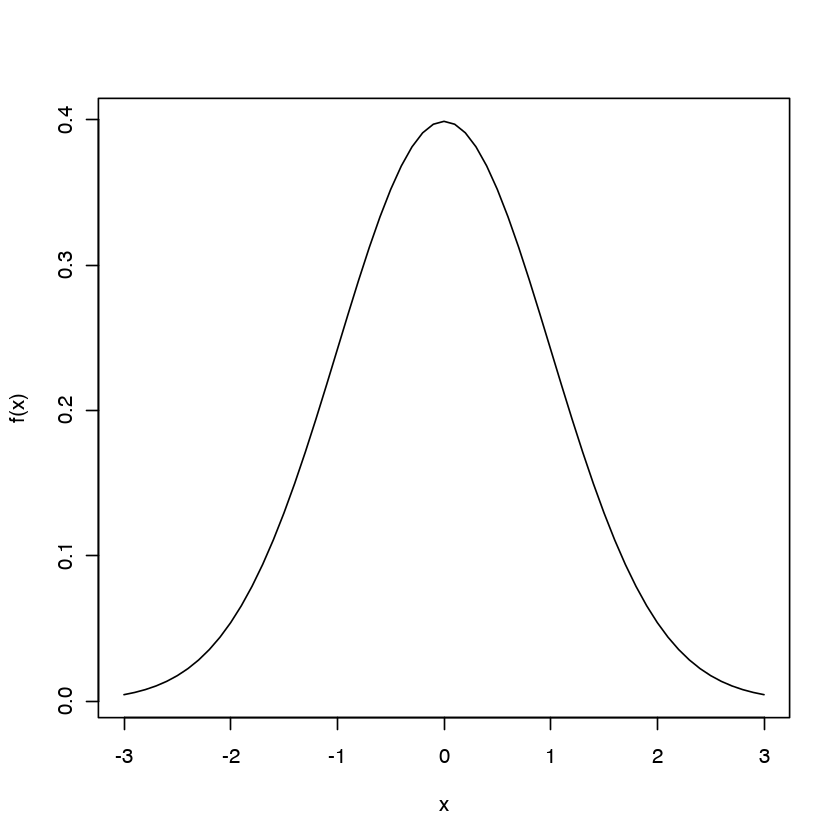
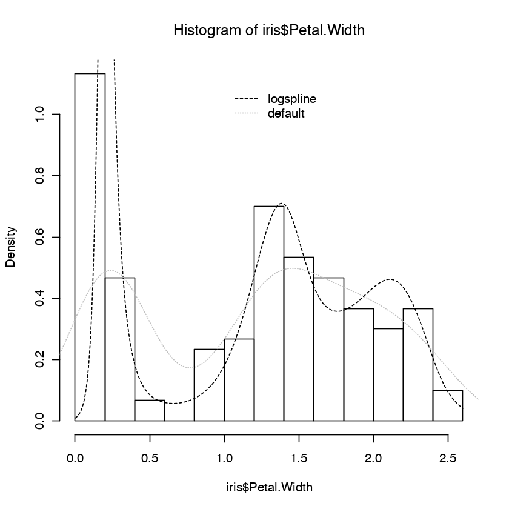
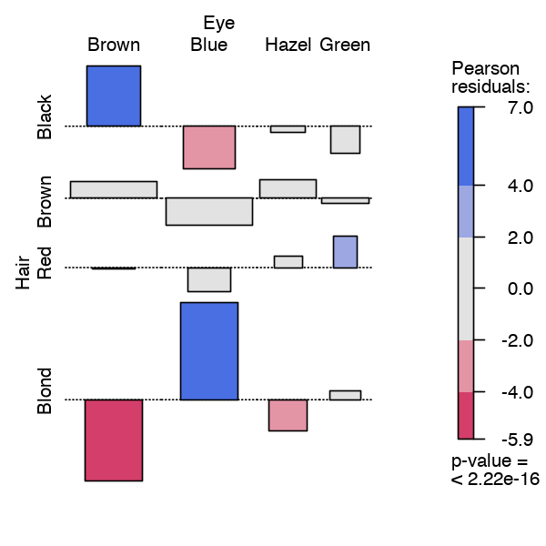
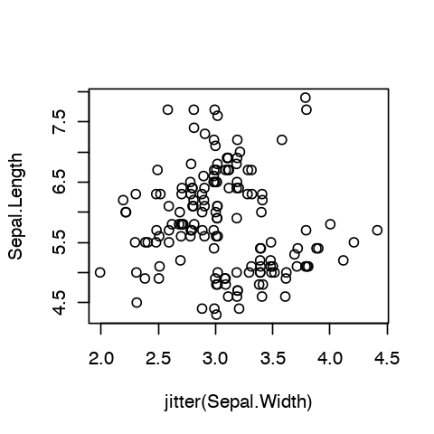
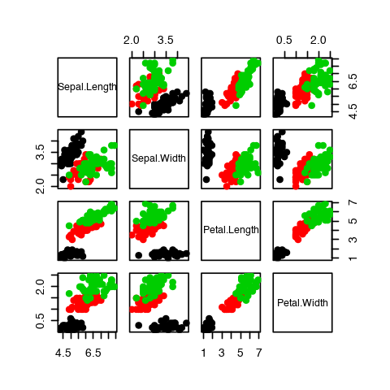

# Period 4: Visualization of genome-scale data with R/Bioconductor

## Overview of visualization

The basic purpose of visualization is to expose the "structure of variation" in datasets.
Even for simple data elements that might occupy a given vector in R
can have intricate "structure" that visualization can help expose.  Before focusing
sharply on tools for genomic visualization, we'll introduce
some basic concepts of statistical modeling to help formalize this concept
of "structured variation".

### Some comments on statistical models 

We will discuss histograms and density estimates for univariate continuous data, and
some views of contingency tables for discrete multivariate data.

#### The concept of a density function

Basic model for continuous univariate measurement: $N$ data points denoted
$x_i, i = 1, \ldots, N$ 

- are _statistically independent_ (value of $x_i$ tells us
nothing about the value of $x_j$, $j \neq i$)
- have relative frequencies prescribed by mathematical functions that have certain properties

Example for students with some exposure to probability theory:  Define 
$$
f(t) = \frac{1}{\sqrt{2\pi}} e^{-\frac{t^2}{2}}
$$
and let $F(x) = \int\limits_{-\infty}^x f(t) dt$.  $F$ is known as the standard
normal or Gaussian _distribution function_.  You can use R to explore this formalism.


```R
myf = function(t) (1/(sqrt(2*pi)))*exp(-t^2/2)
myF = function(x) integrate(myf, -Inf, x)$value
dom = seq(-3,3,.1)
plot(dom, sapply(dom, myF), xlab="x", ylab="F(x)", type="l")
```


The function $f$ defined above is the standard Gaussian _density function_.  We have written code for it already.  It's a little easier to plot it because we coded it in a vectorized way.
(As a mildly advanced exercise, recode `myF` so that it returns a vector of values $F(x)$ for a vector input.)

The density function has a familiar display:


```R
plot(dom, myf(dom), type="l", xlab="x", ylab="f(x)")
```





R has more general Gaussian density and distribution functions built in, in the sense that
mean and variance values can also be specified to define location and spread.


```R
range(myf(dom)-dnorm(dom)) # dnorm is built in
```


<ol class=list-inline>
	<li>0</li>
	<li>0</li>
</ol>


#### Histograms as estimates of densities

A basic tool of exploratory visualization is the histogram.  This can be tuned
in various ways, but let's consider how its default implementation can be used to think about the
plausibility of a model for a given set of data.  We can simulate standard
Gaussian observations in R, plot the histogram, and check its relationship to
the theoretical density.


```R
dat = rnorm(1000) # simulated
hist(dat, freq=FALSE)
lines(dom, dnorm(dom), lty=2)
lines(density(dat), lty=3)
```


Both the default histogram and the default density estimate accurately characterize
variation in the simulated data.  We will now apply them to a classic dataset.

#### Histogram and density with a dataset

R.A. Fisher studied measurements of parts of three species of iris plants.


```R
head(iris)
```


<table>
<thead><tr><th scope=col>Sepal.Length</th><th scope=col>Sepal.Width</th><th scope=col>Petal.Length</th><th scope=col>Petal.Width</th><th scope=col>Species</th></tr></thead>
<tbody>
	<tr><td>5.1   </td><td>3.5   </td><td>1.4   </td><td>0.2   </td><td>setosa</td></tr>
	<tr><td>4.9   </td><td>3.0   </td><td>1.4   </td><td>0.2   </td><td>setosa</td></tr>
	<tr><td>4.7   </td><td>3.2   </td><td>1.3   </td><td>0.2   </td><td>setosa</td></tr>
	<tr><td>4.6   </td><td>3.1   </td><td>1.5   </td><td>0.2   </td><td>setosa</td></tr>
	<tr><td>5.0   </td><td>3.6   </td><td>1.4   </td><td>0.2   </td><td>setosa</td></tr>
	<tr><td>5.4   </td><td>3.9   </td><td>1.7   </td><td>0.4   </td><td>setosa</td></tr>
</tbody>
</table>


We'll use a histogram and default density estimate to visualize the distribution of petal width.


```R
hist(iris$Petal.Width, freq=FALSE)
lines(density(iris$Petal.Width))
```


Both the histogram and the density serve to demonstrate that a unimodal model 
will not work well for this dataset.  

It is worth noting that the default density display seems particularly flawed in that
it appears to support negative width measures.  (The density sketch extended smoothly
at the left boundary will be positive.)  A density estimation tool that can respect
constraints on the measurement range is available in the logspline package.


```R
library(logspline)  # tell logspline no negative values 
suppressWarnings(f1 <- logspline(iris$Petal.Width, lbound=0))
hist(iris$Petal.Width, freq=FALSE)
dom=seq(0,2.6,.01)
lines(dom, dlogspline(dom, fit=f1), lty=2)
lines(density(iris$Petal.Width), lty=3, col="gray")
legend(1.0, 1.1, legend=c("logspline", "default"), 
       lty=c(2,3), col=c("black", "gray"), bty="n")
```





The histogram is a form of 'nonparametric' density estimation -- it makes no assumptions about the functional form of the underlying distribution.  The logspline density estimate
assumes that there is a smooth underlying density, and constraints like bounds
on the observation space can be imposed.  The default density estimator in R
can be tuned, see `?density`.

As a concluding remark on the value of refined density estimation, we note that the logspline
estimate was quite suggestive of a trimodal distribution.  We know more about the
iris data -- it is in fact collected on three different species of plant.  The mean values
of petal width for these species seem to lie close to the modes suggested by the
logspline estimate.  This is much less apparent with the default density estimate.


```R
sapply(split(iris$Petal.Width, iris$Species), mean)
```


<dl class=dl-horizontal>
	<dt>setosa</dt>
		<dd>0.246</dd>
	<dt>versicolor</dt>
		<dd>1.326</dd>
	<dt>virginica</dt>
		<dd>2.026</dd>
</dl>


```R
hist(iris$Petal.Width, freq=FALSE)
dom=seq(0,2.6,.01)
lines(dom, dlogspline(dom, fit=f1), lty=2)
lines(density(iris$Petal.Width), lty=3, col="gray")
legend(1.0, 1.1, legend=c("logspline", "default"), 
       lty=c(2,3), col=c("black", "gray"), bty="n")
abline(v=c(.246, 1.326, 2.026), lty=4)
```


#### Models and visualization for discrete data

We'll briefly address categorical data that do not have a natural ordering.  A nice
example dataset is the `HairEyeColor` array.


```R
HairEyeColor
```


    , , Sex = Male
    
           Eye
    Hair    Brown Blue Hazel Green
      Black    32   11    10     3
      Brown    53   50    25    15
      Red      10   10     7     7
      Blond     3   30     5     8
    
    , , Sex = Female
    
           Eye
    Hair    Brown Blue Hazel Green
      Black    36    9     5     2
      Brown    66   34    29    14
      Red      16    7     7     7
      Blond     4   64     5     8


We'd like to understand whether eye and hair color are associated, and whether
the association varies by gender.  

#### Two-dimensional problem

To begin, we'll collapse over genders and consider 
a model for the $4 \times 4$ table with hair color in rows and eye color in columns:


```R
hae = apply(HairEyeColor,1:2,sum)
hae
```


<table>
<thead><tr><th></th><th scope=col>Brown</th><th scope=col>Blue</th><th scope=col>Hazel</th><th scope=col>Green</th></tr></thead>
<tbody>
	<tr><th scope=row>Black</th><td> 68</td><td>20 </td><td>15 </td><td> 5 </td></tr>
	<tr><th scope=row>Brown</th><td>119</td><td>84 </td><td>54 </td><td>29 </td></tr>
	<tr><th scope=row>Red</th><td> 26</td><td>17 </td><td>14 </td><td>14 </td></tr>
	<tr><th scope=row>Blond</th><td>  7</td><td>94 </td><td>10 </td><td>16 </td></tr>
</tbody>
</table>


Let $p_{ij}$ denote the joint probability of having hair color $i$ and eye color $j$, let $p_{i\cdot}$
denote the marginal probability of having hair color $i$, and let
$p_{\cdot j}$ denote the marginal probability of having eye color $j$.  The
independence model asserts that $p_{ij} = p_{i\cdot} p_{\cdot j}$ for all $i$ and $j$.  Pearson's Chi-squared statistic measures the goodness of fit of this model.  The `assoc` function of the
vcd package displays the magnitudes of residuals (normalized departures from values expected
under the independence model, see ?assoc for details).


```R
library(vcd)
options(repr.plot.width=5, repr.plot.height=5)
assoc(hae, ~Eye + Hair, shade=TRUE)
```

    Loading required package: grid





#### Three-dimensional problem

To address the full dataset,
we'll use the `mosaicplot` function to examine relative frequencies of different
(sex, eyecolor, haircolor) configurations in the data.  With the `shade` parameter
set, we are presented with a collection of colored rectangles that depict the
relative frequencies of the different categories.  Red boxes correspond to 
configurations that are relatively unusual under the assumption of independence.
Blue boxes correspond to configurations that have unexpectedly high prevalence.


```R
options(repr.plot.width=5, repr.plot.height=5)
mosaicplot(HairEyeColor, shade=TRUE)
```


Thus there are fewer blond-haired brown-eyed individuals than expected under
an assumption of independence, and black hair/brown eyes are more common than
would be expected under this assumption.  The discipline of [log-linear modeling](https://books.google.com/books?id=Td5dhfwi31EC&source=gbs_book_other_versions)
and [formalism on the chi-squared test](https://en.wikipedia.org/wiki/Pearson%27s_chi-squared_test) can be reviewed to get a deeper understanding of this technique.

## A quick survey of R's base graphics for multivariate data

### Additional views of Fisher's iris data

We focused before on a single feature.  The full dataset has four features and species label.


```R
head(iris)
```


<table>
<thead><tr><th scope=col>Sepal.Length</th><th scope=col>Sepal.Width</th><th scope=col>Petal.Length</th><th scope=col>Petal.Width</th><th scope=col>Species</th></tr></thead>
<tbody>
	<tr><td>5.1   </td><td>3.5   </td><td>1.4   </td><td>0.2   </td><td>setosa</td></tr>
	<tr><td>4.9   </td><td>3.0   </td><td>1.4   </td><td>0.2   </td><td>setosa</td></tr>
	<tr><td>4.7   </td><td>3.2   </td><td>1.3   </td><td>0.2   </td><td>setosa</td></tr>
	<tr><td>4.6   </td><td>3.1   </td><td>1.5   </td><td>0.2   </td><td>setosa</td></tr>
	<tr><td>5.0   </td><td>3.6   </td><td>1.4   </td><td>0.2   </td><td>setosa</td></tr>
	<tr><td>5.4   </td><td>3.9   </td><td>1.7   </td><td>0.4   </td><td>setosa</td></tr>
</tbody>
</table>


#### Marginal distributions

Using base R to visualize a group of distributions can lead to complications even
when something as simple as the boxplot is in use.  The defaults for the display below
lead to dropping a species label in each plot.  We need to rotate the labels to have
them fit in the available margin space.


```R
par(mfrow=c(2,2))
for (i in 1:4) {
      boxplot(split(iris[,i], iris$Species),
         main=names(iris)[i], axes=FALSE)
      axis(2)
      text(1:3, par("usr")[3] - 0.25, srt = 45, adj = 1,
          labels = levels(iris$Species), xpd = TRUE)
      }

```


It is often of interest to visualize the individual data points.  The beeswarm
algorithm is easy to use.


```R
library(beeswarm)
par(mfrow=c(2,2))
for (i in 1:4) beeswarm(iris[,i]~Species, 
        data=iris, main=names(iris)[i], ylab=" ")
```


Exercise.  Fix the code just above so that all species labels appear.

#### Bivariate distributions

The formula notation is a natural one to use for simple scatterplots.  Because the
data are recorded to only one decimal place, we use `jitter` to reduce overplotting.


```R
par(mfrow=c(1,1))
options(repr.plot.width=4, repr.plot.height=4) # specific for jupyter
plot(Sepal.Length~jitter(Sepal.Width), data=iris)
```





Additional parameters can be given to alter the appearance.


```R
plot(Sepal.Length~jitter(Sepal.Width), data=iris, pch=19, col=Species)
legend(1.9, 7.5, col=1:3, pch=19, legend=levels(iris$Species), bty="n")
```


For a modest number of features, `pairs` provides all pairwise scatterplots.


```R
pairs(iris[,-5], col=iris$Species, pch=19, cex.labels=.9)
```





There are many parameters that control the display of standard R graphics.  See ?par for details.  Some frequently used are cex (character expansion factor), mar (set margins), mfrow (setup a multipanel display), pch (choose plotting glyph), las (alter angle of marginal label rendering).

```
> sort(names(par()))
 [1] "adj"       "ann"       "ask"       "bg"        "bty"       "cex"      
 [7] "cex.axis"  "cex.lab"   "cex.main"  "cex.sub"   "cin"       "col"      
[13] "col.axis"  "col.lab"   "col.main"  "col.sub"   "cra"       "crt"      
[19] "csi"       "cxy"       "din"       "err"       "family"    "fg"       
[25] "fig"       "fin"       "font"      "font.axis" "font.lab"  "font.main"
[31] "font.sub"  "lab"       "las"       "lend"      "lheight"   "ljoin"    
[37] "lmitre"    "lty"       "lwd"       "mai"       "mar"       "mex"      
[43] "mfcol"     "mfg"       "mfrow"     "mgp"       "mkh"       "new"      
[49] "oma"       "omd"       "omi"       "page"      "pch"       "pin"      
[55] "plt"       "ps"        "pty"       "smo"       "srt"       "tck"      
[61] "tcl"       "usr"       "xaxp"      "xaxs"      "xaxt"      "xlog"     
[67] "xpd"       "yaxp"      "yaxs"      "yaxt"      "ylbias"    "ylog"     
```
